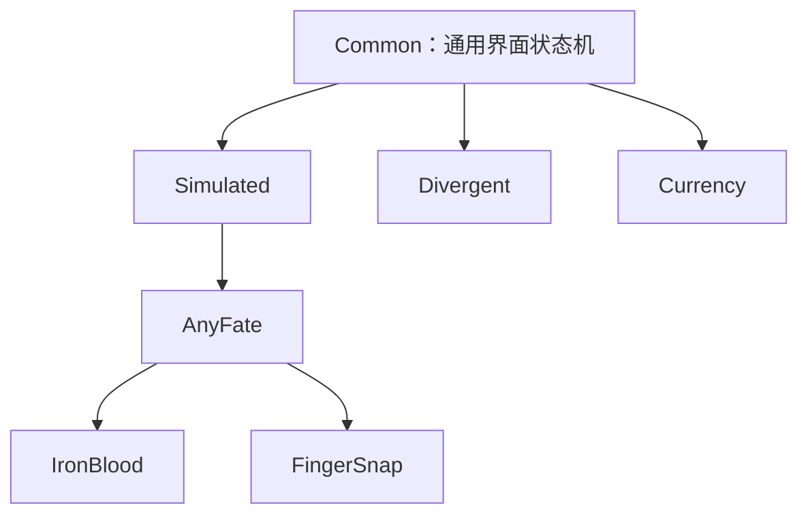

# 内核模块与配置界面

## 职责与目录

每个内核位于 `core/<模块>/`，包含运行代码、配置、独立 UI 和模块描述。`tool/registry.py` 负责发现和加载；`new_gui.py` 根据描述生成入口、显示配置窗口并启动任务。模块的配置字段和专用控件由模块管理，主窗口只提供通用设置及入口容器。

`core` 使用 Python 命名空间包，根目录只存放模块文件夹；注册表和配置存储等公共设施位于 `tool/`。`tool/__init__.py` 负责将发行目录中的外部内核路径加入包的搜索路径。

```text
core/<模块>/
  __init__.py
  module.ini                 # 模块身份、继承关系和加载入口
  engine.py                  # 内核实现
  settings_ui.py             # 配置窗口及保存行为
  ui/                        # 本模块的 Designer 文件
  config/default.json        # 默认配置，也可以使用 YAML
  config/settings.json       # 用户配置，由存储层初始化
  actions/                   # 可选的模块自带 JSON 脚本
  utils.py, ocr.py, ...       # 按实际需要提供的辅助代码
```

Python 文件名和 UI 文件名可以按模块需要设置，加载入口以 INI 为准。公共键鼠、截图、日志和纯计算工具位于 `tool/`，共享资源位于 `resource/`，配置对话框容器位于 `tool/gui/`。运行代码不导入配置 UI，公共工具不反向依赖业务内核。

## 模块描述

`module.ini` 使用 UTF-8 编码。以下为描述格式示例：

```ini
[module]
id = Example
name = 示例内核
description = 示例模块的用途
parent = Common
entry = engine:ExampleKernel
factory = engine:create_engine
settings = settings_ui:SettingsDialog
order = 80
button = 运行示例任务
button_order = 50

[config]
file = config/settings.json
default = config/default.json
legacy = settings.json
keys = example_option
```

| 字段 | 约定 |
| --- | --- |
| `id` | 必填且唯一，使用 Python 标识符；用于继承引用和选择持久化 |
| `name`、`description` | 必填，分别用于显示名称和用途提示 |
| `parent` | 可选，填写父模块 ID；必须与实际 Python 继承关系一致 |
| `entry` | 必填，声明内核类，格式为本模块内的 `Python模块:符号` |
| `factory` | 可运行模块的工厂入口，契约为 `create_engine(*, script=False)` |
| `settings` | 可运行模块必须提供的独立配置入口，契约为 `SettingsDialog(parent=None)` |
| `order` | 调试模式内核下拉框的排序值 |
| `button`、`button_order` | 普通模式的按钮文字和排序值；文字为空时不生成普通按钮 |
| `tray` | 默认 `false`；为 `true` 时提供托盘运行入口 |
| `calibration` | 默认 `false`；为 `true` 时提供全局角度校准所需能力 |
| `file`、`default` | 模块用户配置及默认配置的相对路径 |
| `legacy` | 存储层使用的兼容配置文件名；该文件不存在时从默认配置初始化 |
| `keys` | JSON 字段归属，按字段迁移时填写；完整 YAML 配置不填写此项 |

模块目录名必须是 Python 标识符。描述中的资源路径限制在模块目录内。工厂负责读取配置和适配构造参数，返回对象必须属于 `entry` 声明的类或其子类。

## 动态加载与界面入口

注册表扫描 `core/*/module.ini`，发现阶段只读取描述文件。运行时按父链加载内核类并校验继承，再调用工厂；打开齿轮配置时只导入对应配置入口。

声明工厂的模块进入调试内核下拉框。没有工厂的模块可以作为继承基类使用。普通模式根据 `button` 生成运行按钮及对应齿轮；调试模式通过内核下拉框旁的齿轮打开选中模块的配置窗口。内核与脚本选择分为两行。

脚本列表包含项目 `actions/` 和可运行模块的 `actions/` 中的非空 JSON 动作列表，角色别名等数据文件不作为脚本显示。选择保存为稳定的模块 ID 和项目相对脚本路径；失效选择回退到可用项。

全局调试模式由配置文件中的 `debug` 控制，GUI 不提供修改控件。通用设置在主窗口维护，模块设置在独立窗口维护。添加模块配置项只需修改该模块的配置、Python 和 UI，无需调整 `new_gui.py` 或 `resource/ui/UI.ui`。

## 继承与模块移除

模块通过声明的父链依赖公共能力。项目内核的继承关系如下：



关闭程序后移走模块目录，下次启动会移除相应的入口和自带脚本。没有子模块依赖的模块可以独立移除；移除父模块会使其依赖链不可用。重复 ID、缺失父模块、继承循环和损坏的描述文件会产生诊断，其他有效模块仍可使用。

没有可用内核时禁用运行、配置和诊断入口。托盘入口不可用时回退到第一个可用普通按钮；没有提供校准能力的模块时禁用校准。

## 通用内核与动作接口

`core/common/engine.py` 中的 `StateKernel` 提供界面状态机，各内核直接或间接继承它。它管理当前状态、前一状态、更新时间、动作历史、触发间隔和一次触发标记，支持文本、定位图片、全局图片及纯状态触发，并集中分发脚本动作。

`Common` 的运行工厂位于 `core/common/runtime.py`，返回继承 `StateKernel` 的 `ScriptKernel`。它使用公共窗口识别、截图、图像匹配、坐标操作和 `core/common/ocr.py` 执行选定的 JSON 脚本，无需加载业务内核。其配置窗口管理供继承内核共用的运行参数。

| 接口 | 职责 |
| --- | --- |
| `update_state` | 更新界面状态及变化时间 |
| `match_actions` | 按脚本顺序识别触发条件并执行首个命中动作 |
| `run_static` | 组织一次界面识别与动作执行；模块可适配自己的返回值和等待规则 |
| `do_action` | 分发文本、图片、坐标、按键、等待、拖拽、滚动和状态更新动作 |
| `action_press`、`action_sleep` | 适配模块的输入和暂停语义 |
| `prepare_script` | 准备脚本所需的输入资源或辅助控制器 |
| `static_completed` | 执行模块专用的动作完成规则 |
| `get_screen`、`ts` | 提供截图和 OCR，供脚本执行循环使用 |
| `start` | 启动模块自身的主循环，推进识图、寻路、战斗与状态转移 |
| `stop` | 停止操作并清理运行资源 |

`tool/action_script.py` 装载选定脚本至内核的 `default_json` 与 `default_json_path`，调用该内核的 `start()`，并在退出时停止内核。运行脚本仍使用业务内核自身的主循环，界面动作匹配与寻路、战斗及状态推进配合执行；`run_static()` 只负责一次识别与动作分发，不能替代业务主循环。`Common` 自身提供纯 JSON 动作循环，不依赖业务内核。业务专用动作、结算规则和路径计算由各模块实现。公共 OCR 的识别参数由调用方传入，使用默认参数时不依赖其他内核配置。

## 配置存储与保存

`tool/storage.py` 按模块描述定位配置。用户配置存在时以它为准；不存在时使用默认值，或从 `legacy` 指定的兼容配置初始化。JSON 只迁移 `keys` 声明的字段，迁移前备份，模块文件写入成功后移除兼容文件中的对应字段；YAML 完整复制。全局通用设置和未知字段不属于模块迁移范围。

共享参数只保存一份，位于 `core/common/config/`；专用参数保存于所属模块的 `config/`。纯计算工具通过调用参数接收配置值，不自行读取业务模块配置。

配置通过同目录临时文件原子替换，避免写入失败截断原文件。保存合并已有数据并保留未知字段；联合 JSON 保存失败时恢复已写文件。使用内存配置对象的模块需在写入失败时恢复内存值。

配置窗口复用 `tool/gui/settings_dialog.py`，模块实现 `persist()`。保存前校验输入，成功后关闭窗口；失败时显示原因并保留窗口。取消不保存输入。首次配置初始化属于加载过程，不受取消操作影响。

## 扩展、构建与验证

添加模块时建立目录和描述，提供符合契约的运行工厂、配置窗口及默认配置，并确认 Python 继承与 `parent` 一致。需要普通运行按钮或校准入口时，在描述中声明对应能力。

`SimSce.spec` 的 `hookspath` 指向 `packaging/hooks`；命令行打包也可使用 `--additional-hooks-dir packaging/hooks`。`hook-tool.registry.py` 收集内核 Python 模块。发行流程复制外部 `core/`，保留 INI、默认配置、UI 和动作资源，排除缓存与用户配置。模块目录在源码运行和发行版本中均作为发现依据。

验证应覆盖按需导入、继承校验、模块移除、配置初始化、保存与取消、选择持久化及动作退出清理。GUI 验证使用完整主窗口和真实配置窗口，检查两种模式、长日志和状态文字下的布局。测试配置与模块使用临时副本，隔离热键、启动清理和游戏输入；设备模拟测试与实际游戏运行验收分别记录。
